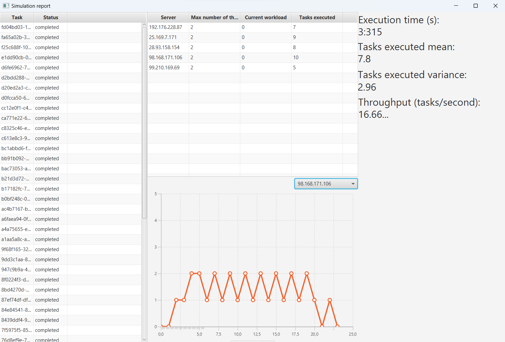

# Contract Net simulation
A software providing a comprehensible user interface for the simulation of the [Contract Net](https://en.wikipedia.org/wiki/Contract_Net_Protocol) protocol, implemented using [LighTS tuple-based middleware](https://lights.sourceforge.net/).

## About The Project



This project focuses on developing a simulation for task assignment using tuple space based messages and different protocols.
The simulation involves assigning tasks to servers and evaluating the performance of different protocols.
Other than the Contract Net protocol, some other protocols where implemented:

* Random assignment
* Round Robin assignment 
* Decentralized

The performance of these protocols can be evaluated using different metrics to determine their effectiveness in task assignment.
  
### Servers and Tasks

The main components of the simulation are servers and tasks.

Servers:
* Are identified by a unique IP address. 
* Are associated with a certain number of threads. Each one can perform a single task at a time.
* Have the same computing resources with respect to the others.

Tasks:
* Are identified by a unique ID.
* Are associated with a specific execution time known by the master.

### Implemented Protocols

* ContractNet (Accept First): Master assigns a task to the first server which comes up with a proposal.
* ContractNet (Balanced): The process is pretty similar to the previous one but this time the master orders proposals before accepting them. This means that, assuming the master receives two proposals, the one accepted will be the one coming from the least loaded server.
* Random A Priori: The master a priori assigns tasks to servers randomly. 
* Round Robin: Master assigns tasks in a circular order to servers.
* Decentralized: The master publishes tasks. The servers have the ability to independently make decisions on whether to take care of a certain task or not.

### Evaluation Metrics

* Execution Time: Total time taken for the entire simulation to run from start to finish.
* Tasks Executed Mean: Average number of tasks completed by the servers over the course of the simulation.
* Tasks Executed Variance: Degree of dispersion or variability in the number of tasks completed by servers during the simulation.
* Throughput: Quantifies the rate at which tasks are processed by the servers.

## Getting Started

### Prerequisites

You need to have these software installed in order to run the simulation.
* Java
* Maven

### Usage

Run this command to start the simulation.
```
mvn javafx:run
```